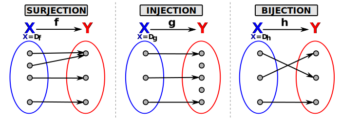
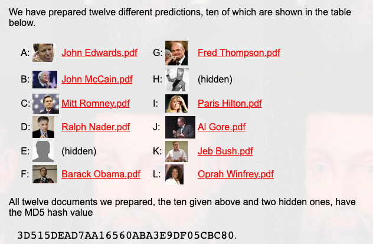
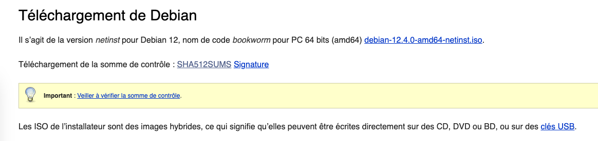
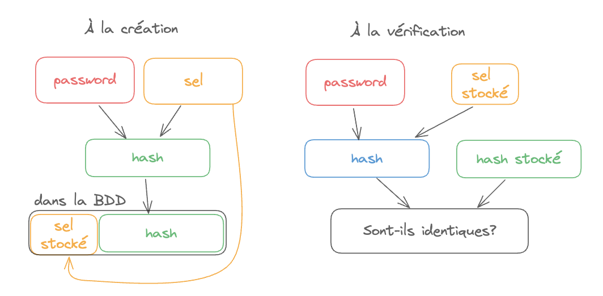
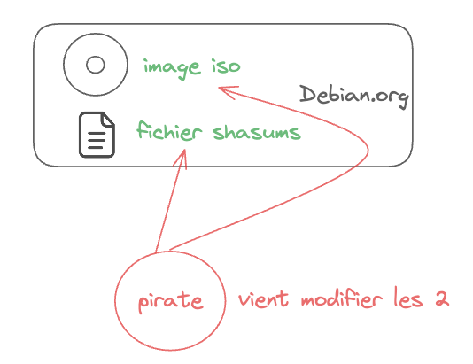
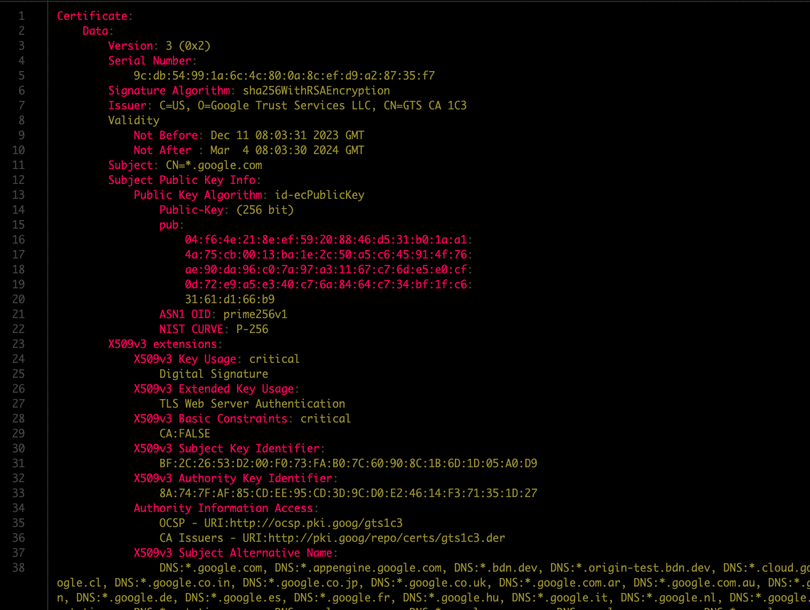
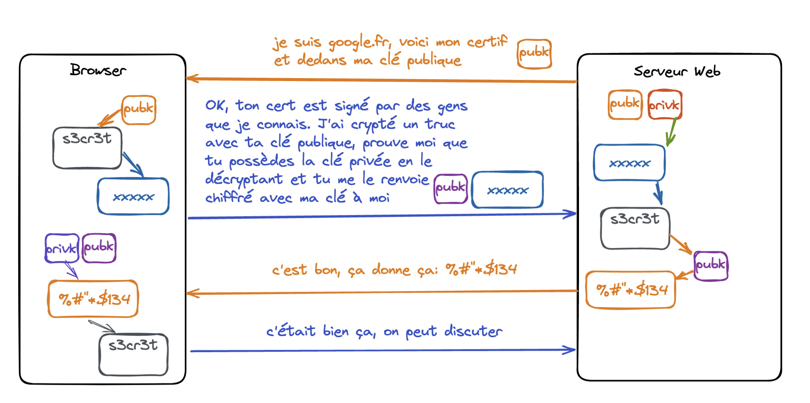
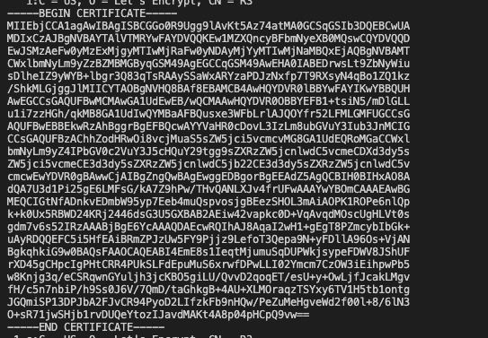

<style scoped>
h1 {
  text-align: center;
}
p {
    position: absolute;
    bottom: 50px;
    right: 30px;
}
img[alt~="center"] {
  display: block;
  margin: 0 auto;
}
</style>

# Cryptographie 2ème partie

Guillaume Bienkowski — Braincube

---
<!-- header: "Plan de l'après midi" -->

# Plan

Cours
- Fonctions de hachage
- Signatures digitales
- Certificats

$\rightarrow$ Durée 1h30. 40 Slides. 2 minutes par slides, c'est *intense*.

Mise en pratique (TP)

$\rightarrow$ Durée 1h30


---
<!-- header: "Fonctions de Hachage" -->
# Fonction de hachage

## Définition

> Une fonction de hachage est une fonction qui convertit une entrée de taille arbitraire en sortie de taille déterminée


## Terminologie

Le résultat d'une fonction de hachage s'appelle un *hash* ou une *empreinte*, parfois un *condensat*


---

# Fonction de hachage parfaite $f: X \to Y$:

$\forall x \in X, \forall x' \in X$ alors $(f(x) = f(x') \implies x = x')$

On dit que $f$ est *injective*.

**Implications**: si $X$ est grand alors $Y$ sera au moins aussi vaste => ne rentre pas dans la RAM d'un ordinateur
**En pratique**: $Y$ a une taille finie (énorme, mais finie).




---

# Collision

Une collision, c'est quand deux valeurs en entrée d'une fonction de hachage donnent la même sortie.

Par exemple:

```python
>>> def mafonctiondehachage(x):
...   return x % 32768
...
>>> mafonctiondehachage(10)
10
>>> mafonctiondehachage(32778)
10
>>>
```

---

# Fonction de hachage cryptographique

Une fonction de hachage cryptographique idéale possède les six propriétés suivantes:

- un même message aura toujours la même valeur de hachage (**déterminisme**)
- le hash d'un message se calcule "facilement" (pour un ordinateur)
- impossible, pour un hash donné, de construire un message ayant cette valeur (**préimage**)
- impossible de trouver un second message ayant le même hash qu'un message donné (**seconde préimage**)
- impossible de trouver deux messages différents ayant le même hash (**collision**)
- modifier un tant soit peu un message modifie **considérablement** la valeur de hachage


---

# Exemples de fonctions de hachage cryptographiques

$d$ est la taille de l'ensemble de sortie $Y$ en bits.

- famille SHA (1, 256, ...) ($160 ≤ d ≤ 512$)
- MD5 ($d = 128$), dépréciée! Ne jamais utiliser.
- Whirlpool ($d = 512$)
- BCrypt ($d=192$), Scrypt, Argon2 ($d=256$)
- $maFonction(x) = x \mod 32768$ ($d=15$) (pas très efficace celle là)

---
# Exemple sous linux

    $ (echo "123456789" | shasum) \
      (echo "123456779" | shasum)
                    ^

    6d78392a5886177fe5b86e585a0b695a2bcd01a05504b3c4e38bc8eeb21e8326
    8f9d6dbc5c656b3fd63f25e72c3ec9d7738f198238a46eeb01875ee102c34860

### Petit changement en entrée => grande différence en sortie

---

Collisions trouvées pour:

- MD5 créé en 91, collision en 96.
- SHA1 créé en 95, fragile dès 2005, collision en 2017


PDF de résultats des [élection Américaines de 2008](https://www.win.tue.nl/hashclash/Nostradamus/)




---

<!-- header: "Applications aux fonctions de Hachage" -->

# Applications des hash

## HashMaps, Dictionnaires (Programmation)


**Avantages**: $f(x)$ TRÈS rapide vs itération systématique du tableau
<!-- Faire un dessin au tableau pour expliquer l'intérêt -->
---

## Vérification d'intégrité

*Rappel*: différences minimes => hash complètement différents



Permet de s'assurer que le fichier (gros) qu'on a téléchargé est bien le même que celui hébergé par le serveur.

```
0262488ce2cec6d95a6c9002cfba8b81ac0d1c29fe7993aa5af30f81cecad3eb66558b9d8689a86b57bf12b8cbeab1e11d128a53356b288d48e339bb003dace5  debian-12.4.0-amd64-netinst.iso
e0da46ec9a0000c79f8c1abe08798afa674b71a4f232b4760c28bcb1717d3c7f6962fa1523769576a924c879710cde6f5ac82402633c4b84c8da6a48c37d61ed  debian-edu-12.4.0-amd64-netinst.iso
fecfa87d9bcf555a2181078e1d629ebd11554b78fbd59888a438ec2c1b4f4cb27eb75013ebdb8f86cfac5fad19a07bca84dc1bc00b0787fc842d5e318748de84  debian-mac-12.4.0-amd64-netinst.iso
```

---

## Stockage obfusqué d'un password

On ne stocke jamais un mot de passe en clair dans une base de données:


=> *NON*

On stocke un hash:


=> *Mieux*

Si la BDD est piratée, impossible de dériver (facilement) le mot de passe.

---

### Vérification du mot de passe


L'utilisateur envoie son login et mot de passe, on le hash, et on vérifie que ce hash est le bon pour cet utilisateur.

---

Attaques: **Rainbow Tables** et autres attaques basées sur un dictionnaire

- 1 mot de passe de 8 caractères de long contient (`0-9`, `a-z`, `A-Z`) => 62 symboles différents
- $62^8 = 218340105584896$ combinaisons possibles, un sha256 est stocké sur 32 bits
- $62^8 * 32$octets $=6.2\nobreakspace Pio$

À la portée de n'importe quelle Fortune 500, voire du commun des mortels pour quelques heures en louant du disque chez Amazon.

Solution: *saler* son hash.
<!-- En pratique, on peut aller jusque 14 caractères sur du sha256 maintenant -->

---

### Salage - Problématique

|User |    Hash    |
|-----|------------|
|alice |  `4420d1918..`|
|jason |  `695ddccd9..`|
|mario  | `cd5cb49b8..`|
|teresa | `73fb51a0c..`|
|bob   |  `4420d1918..`|
|mike  |  `77b177de4..`|

2 utilisateurs ont manifestement le même mot de passe. Qui sont-ils?


---

### Salage - comment on fait

On ajoute un petit peu d'aléatoire dans le calcul du hash pour tempérer les attaques par dictionnaires.

```python
password = '4gNnLar5'
salt = getRandomString(length=math.randint(5,15))
# par exemple salt='VmBgeaZ2PN', différent pour chaque password stocké!

normal_hash = sha256(password)
salted_hash = salt + '!' + sha256( salt + password ) # '!' sépare le sel du hash

# normal hash: c36b9fc5e51d59f5179e9cc2a0e1f02ea6c2f12448e9e1dfe01f68786092a924s
# salted hash: VmBgeaZ2PN!93d4b242b475a73d8f2d1de1... c'est ce qu'on va stocker
```

=> password de longueur 8, mais stocké hashé avec un random de taille aléatoire.

---

### Salage - Vérification



---

### Salage - pourquoi ça marche ?

|User |    Hash    | Salted hash |
|-----| ------------ | ---- |
|alice |  `4420d1918..`| `3’r43d!3dae5f..` |
|jason |  `695ddccd9..`| `4fTfcz!5g896da..` |
|mario  | `cd5cb49b8..`| `Jeikdiucgh!de34a28..` |
|teresa | `73fb51a0c..`| `ùefs5FS!f290ff5..` |
|bob   |  `4420d1918..`| `èFGz4Ds!99g6bde..` |
|mike  |  `77b177de4..`| `DR"S2ç!22d45dd..` |

Impossible de dire qui a le même password qu'un autre.
Impossible d'utiliser une attaque à dictionnaire sur mdp de longueur 8.


---

## Autres applications

- [HaveIBeenPwnd](https://haveibeenpwned.com/)
- [Private Contact Discovery](https://signal.org/blog/private-contact-discovery/) (Signal)
- Blockchain
- Signatures digitales


----

# Signatures digitales

Revenons au téléchargement de notre fichier iso Debian:

Si ${sha256}(fichier) = S_{Controle}$ alors je sais que le fichier est *intègre* (les octets sont les mêmes que sur le serveur)

Comment vérifier l'*authenticité* du fichier? (que c'est bien Debian qui me l'a fourni)
=> La signature digitale, qui utilise la crypto asymétrique



---

## Principe
- on crypte *l'empreinte* avec une clé privée (c'est la *signature*)
- on diffuse la clé publique associée
- les gens sont capables de décrypter la signature, récupérer l'empreinte, et vérifier par eux mêmes


---

## Vérification

On a un ISO et un fichier de signature

- on calcule le hash de l'iso
- on decrypte la signature et on obtient le hash théorique
- Si les deux sont identiques: c'est bien Debian qui a fabriqué cet ISO


---
# Récapitulatif

- **`C`**: Le chiffrement assure la **confidentialité** de la donnée, cf le cours précédent
- **`I`**: Un *hash* (ou empreinte) assure **l'intégrité** de la donnée
- **`A`**: Une signature assure **l'authenticité** de la donnée

CIA n'est pas qu'une grande agence de sécurité Américaine, mais aussi l'un des fondements de la sécurité informatique.

---
<!-- header: "Certificats" -->

# Certificats


---

# Certificats

Les certificats sont à la base de:

- l'internet moderne
- la sécurité de vos apps Android, iOS, du boot à l'execution
- la sécurité en entreprise
- l'interception et l'analyse du traffic dans les pays liberticides
- une myriade d'usages dès qu'il y a besoin d'authentification

Format d'échange de certificats standardisé: X.509

Ils utilisent tout ce qu'on vient de voir.

---

Un certificat contient:

- une clé *publique*
- les informations du certificat (exemple: nom de domaine lié à ce certificat, date d'expiration, etc.)
- une signature de ce certificat (rappel: signature =
  `chiffrage( clé privée, HASH( contenu du certificat) )` ) par la clé d'un autre certificat, ou la sienne

La clé *privée* associée à la clé *publique* permet d'authentifier celui qui présente le certificat

La signature du certificat provient:

- d'une autorité de certification dont la clé publique est dans le porte clé de confiance (dans l'OS ou le navigateur)
- ou de la machine qui présente le certificat ("certificat autosigné"), dans ce cas la clé privée


---


---

## Chaîne de certification

Exemple pour les certificats TLS utilisés sur internet:
- Les navigateurs n'embarquent que les certificats des autorités dite "Racines", qui sont de gros groupes commerciaux audités ou des gouvernements.
- Ces certificats racines signent des certificats intermédiaires, et les fournissent aux autorités de certification "Tier 2", qui peuvent à leur tour signer des certificats
- Moi, toto.com, demande à une de ces autorités de certification tier 2 de signer mon certificat avec sa clé privée, moyennant finances et preuves que je possède bien ce nom de domaine.
- La chaîne de confiance s'établit de proche en proche
---

## Chaîne de certification


---
## Anatomie d'un certificat

```
$ echo \
   | openssl s_client -connect google.com:443  2>/dev/null \
   | openssl x509 -text
```



(lancez la commande dans votre terminal et admirez la liste de DNS Google)

---

## Établissement de connection SSL/TLS

[TLS 1.3](https://davidwong.fr/tls13/)

1. Le client établit un canal sécurisé (chiffrement symétrique) avec le serveur (en utilisant un echange via Diffie-Helman)
2. Le serveur web présente son certificat au client
3. Le client vérifie la chaîne de certificats pour authentifier le serveur. Envoie un challenge chiffré avec la clé publique du serveur, et envoie sa clé publique
4. Le serveur web décrypte le challenge avec sa clé privée et le crypte avec la clé publique du client
5. Si le serveur arrive à renvoyer le challenge au client, c'est qu'il possède la clé privée.


---




---

### Le format x509 et PEM

Un certificat peut se transporter en binaire ou en texte.

x509 détermine le format binaire des information dans le certificat.

PEM est un format d'échange (un "container") au format texte des certificats.

En-tête: `-----BEGIN CERTIFICATE-----`

Bas de page: `-----END CERTIFICATE-----`

---

### Exemple de certificat au format PEM




---

## Compromission d'un certificat

Si la clé privée associée à un certificat est exposée, alors ce certificat devient *compromis*: toute personne qui possède la clé privée peut l'utiliser pour se faire passer pour le serveur légitime.

Dans ce cas, on *révoque* le certificat

2 solutions:
- Certificate Revocation List
- Online Certificate Status Protocol (vulnérable à une attaque "replay")

Les urls de ces deux mécanismes sont intégrées aux certificats sous la forme d'attributs (tout comme la date ou le numéro de série)

---

### Certificate revocation list

Une simple liste, signée cryptographiquement par l'autorité de certification, qui liste les certificats révoqués.

Avantages:

- simple à créer,
- simple à publier (même en HTTP)

Inconvénients:


---
### Certificate revocation list

Une simple liste, signée cryptographiquement par l'autorité de certification, qui liste les certificats révoqués.

Avantages:

- simple à créer,
- simple à publier (même en HTTP)

Inconvénients:
- la liste grossit régulièrement => chaque réponse doit envoyer la CRL en entier
- 99% inutile: je ne suis intéressé que par mon certificat, pas le reste de la liste

---

### OCSP

Méthode plus récente, basée sur une API:

- je veux savoir si le certificat présenté par toto.com est valide
- je contacte l'URL OCSP indiquée dans le certificat avec le Serial du certificat à vérifier
- l'URL répond avec un "Good" / "No good" __signé__ pour dire si le certificat est bon ou pas

Avantages:
- très succinct: j'ai la réponse pour MON certificat, et seulement lui
- et donc très économe en resources et rapide à répondre

Inconvénients:
- réponses signées mises en cache, sans expiration ni *nonce*, et donc susceptibles d'être rejouées à un client.

---

<style scoped>
section {
  justify-content: start;
}
</style>
# MITM (Man In The Middle)


---
<style scoped>
section {
  justify-content: start;
}
</style>
# MITM (Man In The Middle)


---
<style scoped>
section {
  justify-content: start;
}
</style>
# MITM (Man In The Middle)


---

## Authentification par certificat client

### Je demande à mon interlocuteur de me fournir un certificat. Pour cela:

1. Je crée un couple de clés, et je crée un certificat non signé avec la clé publique
2. J'envoie ce certificat pour signature ("CSR") au serveur web, qui me le renvoie signé.

### Au prochain login, j'envoie mon certificat au serveur.

1. Il peut vérifier qu'il l'a bien signé en vérifiant la signature;
2. Il peut m'authentifier via l'authentification par clé publique, car ma clé est présente dans le certificat (Challenge/Réponse)
3. De mon côté je suis sûr de parler au même serveur car il m'a fourni sa clé publique.

Authentification très forte, résiste aux MITM.

---

C'est la fin du cours, on fait une PAUSE. Puis on se lance dans le TP.

---
# Questions

---

# Trivia


https://support.apple.com/fr-sn/HT212248

---

# Trivia

Lenovo Superfish

- Embarque dans tous les ordinateurs Lenovo un certificat racine autosigné
- Embarque aussi la clé privée (protégée par mot de passe)
- Le mot de passe est trouvé facilement, et des certificats bidons peuvent être générés (pour google.com par exemple)
- TOUS les ordinateurs Lenovo pourront être dupés par ces certificats

[Source](http://blog.erratasec.com/2015/02/extracting-superfish-certificate.html)

---

# Biblio

[Exemple d'échange de clé DH](https://fr.wikipedia.org/wiki/%C3%89change_de_cl%C3%A9s_Diffie-Hellman) (Wikipédia)

[Exemple de chiffrage clé publique (RSA)](https://fr.wikipedia.org/wiki/Chiffrement_RSA) (Wikipédia)

[Support TLS du browser](https://cc.dcsec.uni-hannover.de/)

[RFC Certificats x509](https://tools.ietf.org/html/rfc5280)

[Décoder un pem](https://lapo.it/asn1js/) (mais sinon, utiliser openssl)

[Chiffrement RSA](https://fr.wikipedia.org/wiki/Chiffrement_RSA) (Wikipédia)

[Chiffrement par courbes elliptiques](https://en.wikipedia.org/wiki/Elliptic-curve_cryptography) (Wikipédia)

[Un site qui explique tout ça vraiment bien (et en français)](http://www.bibmath.net/crypto/index.php)


---

## Si on a le temps

Blockchain, Proof Of Work, Bitcoin.
