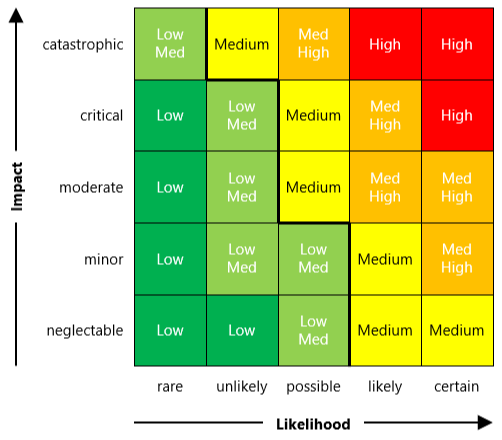
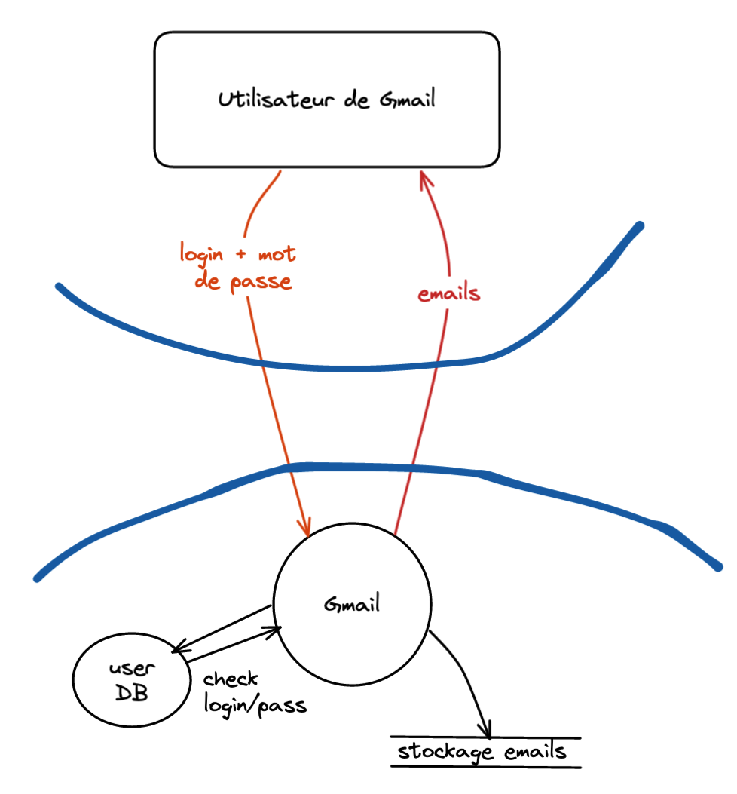

<style scoped>
h1 {
  text-align: center;
}
p {
    position: absolute;
    bottom: 50px;
    right: 30px;
}
img[alt~="center"] {
  display: block;
  margin: 0 auto;
}
</style>

# Sécurité & Modélisation des menaces

Guillaume Bienkowski — Braincube

---
<!-- header: "Plan de l'après midi" -->

# Plan

- Introduction
- Présentation de la sécurité
- Gestion des risques de sécurité
- TD


---
<!-- header: "Introduction" -->

# Introduction

Une petite histoire...

---
# La largeur du domaine de la sécurité

Des myriades de sous domaines:

- sécurité des personnes (physique et mentale)
- sécurité des biens (DAB, stocks, etc.)
- sécurité économique
- sécurité de l'environnement (chimie, nucléaire, etc.)
- sécurité de l'information (c'est là qu'on va travailler)

---

# L'objectif de ce cours/TD: la sécurité de l'information

La sécurité est un vaste sujet, nous nous concentrerons sur la sécurité de l'information.

Ce cours présente une méthodologie et un exemple concret de sécurisation d'un ensemble de logiciels de traitement de l'information.

---
<!-- header: "La sécurité comme une gestion du risque" -->

# CIA / CID

Modèle qui sous-tend la grande majorité des méthodes de sécurisation. Ce sont les 3 choses considérées comme nécessaires à la sécurité de l'information.

- **Confidentialité**
  La donnée doit être accessible uniquement aux destinataires légitimes.

- **Intégrité**
  La donnée ne doit pouvoir être créée, modifiée ou supprimée seulement par les utilisateurs légitimes

- **Disponibilité** (Availability)
  La donnée doit être consultable à tout moment par les utilisateurs.

---

# La sécurité parfaite n'existe pas

- facteur humain
- course aux armes -- intérêt financier, hackers motivés VS équipe de sécurité
- asymétrie du problème: 1 seule vulnérabilité compromet l'entièreté du système
- évolutions techniques / vétusté, facteurs économiques
- éléments naturels (*Disponibilité*)

$\rightarrow$ insoluble, mais on peut réduire les *risques*

---

# La sécurité (informatique) comme une gestion du risque

Glossaire:

***Vulnérabilité***: une faiblesse du système étudié. Faiblesse matérielle, logicielle ou de procédure ("*il n'est pas écrit qu'il faut fermer le coffre fort en partant le soir*").

***Menace***: un événement qui pourrait vous porter préjudice. Une catastrophe, un attaquant interne ou externe motivé, ...

***Risque***: conjonction entre les vulnérabilités et les menaces

***Impact***: les conséquences si le risque survient.

---

# La sécurité comme une gestion du risque

De chaque menace et vulnérabilité découle un risque:

**Vulnérabilité**: le béton de l'enceinte de confinement de ma centrale ne résiste pas à plus 40 tonnes de pression extérieure

**Menace**: Un attaquant motivé pourrait détourner un avion de 100T et le diriger sur mon enceinte de confinement

**Risque**: Il est possible que mon confinement soit inadapté à un avion de ligne qui s'écraserait sur mon bâtiment.

**Impact**: Le coeur de ma centrale pourrait entrer en fusion, >100 morts immédiats, >100 000 morts sur 10 ans

---

# La sécurité comme une gestion du risque

Autre exemple:

**Vulnérabilité**: mon logiciel possède une faille de sécurité exploitable pour exfiltrer les données de mes clients

**Menace**:

**Risque**:

**Impact**:

---

# La sécurité comme une gestion du risque

Autre exemple:

**Vulnérabilité**: mon logiciel possède une faille de sécurité exploitable pour exfiltrer les données de mes clients

**Menace**: ma société est assez grosse pour attirer des attaquants motivés et perfectionnés, disons 1 chance sur 100 dans l'année

**Risque**:

**Impact**:

---

# La sécurité comme une gestion du risque

Autre exemple:

**Vulnérabilité**: mon logiciel possède une faille de sécurité exploitable pour exfiltrer les données de mes clients

**Menace**: ma société est assez grosse pour attirer des attaquants motivés et perfectionnés, disons 1 chance sur 100 dans l'année

**Risque**: Mes données risquent d'être publiées ou utilisées par des attaquants motivés pour couler mon business.

**Impact**:

---

# La sécurité comme une gestion du risque

Autre exemple:

**Vulnérabilité**: mon logiciel possède une faille de sécurité exploitable pour exfiltrer les données de mes clients

**Menace**: ma société est assez grosse pour attirer des attaquants motivés et perfectionnés, disons 1 chance sur 100 dans l'année

**Risque**: Mes données risquent d'être publiées ou utilisées par des attaquants motivés pour couler mon business.

**Impact**: Perte de > 50% des clients, voire faillite

---

<!-- header: "Méthodologie" -->

# Comment addresser ces risques

Il existe une myriade de méthodes: [EBIOS](https://www.ssi.gouv.fr/guide/ebios-2010-expression-des-besoins-et-identification-des-objectifs-de-securite/), [MEHARI](https://clusif.fr/services/management-des-risques/les-fondamentaux-de-mehari/), [OCTAVE](https://resources.sei.cmu.edu/library/asset-view.cfm?assetid=13473), ...

Toutes se valent.

La plupart utilisent les mêmes prémisses:
- Assurer le CIA/CID
- Échelonner les réponses en accord avec les risques
- Suivi long terme des actions, et ré-évaluation régulière

---

# Comment addresser ces risques

À partir de ce constat, on échelonne les mesures de sécurité selon 2 axes:

- la probabilité de la menace
- les conséquences, l'impact, la gravité de la menace

L'évaluation est subjective: elle va permettre d'ordonner les mesures selon leur impact.



---

# La méthode d'analyse


C'est celle qui est recommandée par l'ANSSI.

---

# Plusieurs types de solutions à une menace de sécurité

- **Techniques**
  La conception du logiciel ou sa mise en oeuvre réduisent voire empêchent carrément le souci de sécurité. Poka Yoke.
  *Exemples:*
    - logiciel qui tourne avec un utilisateur dédié sur la machine, et non pas en *root*.
    - Authentification déléguée OpenID ou SAML: plus besoin de stocker de mot de passe.
    - Publication d'une nouvelle version impossible si des vulnérabilités sont détectées via scanning automatique

---

# Plusieurs types de solutions à une menace de sécurité

- **Organisationnelles ou humaines**
  La structure de l'entreprise et du travail rend insignifiante ou inopérable la vulnérabilité
  *Exemples:*
    - Accès aux salles des machines via badge, autorisé seulement aux admin systèmes
    - Impossible de faire entrer du code sans relecture
    - Rituels de revue des risques (réunion de sécurité, ...)

---

# La méthode d'analyse

## 4 étapes:

1. identification des biens à protéger
2. énumération des manières d'enfreindre le *CID* sur ces biens
3. détermination de l'impact et la probabilité d'occurrence, hierarchisation des risques
4. élaboration de contre mesures techniques ou organisationnelle pour réduire ces risques

---

# Identification des biens à protéger

On utilise la méthode du Data Flow Diagram.


Modélisation via un diagramme énumérant tous les flux de données, et les frontières de changement de droits.

---
# Identification des biens à protéger

La liste des biens est constituées des choses en lesquelles un attaquant est intéressé.

Dans le diagramme de flow, les flux de données et les endroits de stockages sont généralement les endroits intéressants.

---
# Exemple de Data Flow Diagram

Exemple avec un flow simple d'utilisateur Gmail.

On explore pas ici les utilisateurs admin ou le processus de création d'utilisateur ou de changement de mot de passe.




---
<!-- header: "TD" -->

# On démarre le TD

---

1. Télécharger le code du TD:

   ```
   git clone https://github.com/masterind4/masterind4.github.io.git
   cd masterind4.github.io/td_securite
   ```

2. Télécharger sur votre ordinateur le document suivant au format ODS: [document support](https://docs.google.com/spreadsheets/d/10soJKARve92w44vQMbgr1BqBLLsQonHyih3E5ho9-bk/edit?usp=sharing)

  Au besoin, il se trouve dans le dossier `td_securite` que vous venez de télécharger.

3. Télécharger docker-compose

    ```
    # dans le dossier td_securite
    curl -JL -o docker-compose https://github.com/docker/compose/releases/download/v2.2.3/docker-compose-linux-x86_64
    chmod +x docker-compose
    ```

---

# Le sujet

Nous allons réaliser une étude des menaces sur une entreprise dont vous êtes un des architectes logiciel.

Le composant que nous allons étudier est le système d'ingestion de données d'Assurance Qualité de vos prestataires.

Il faudra utiliser l'analyse de risques que l'on vient de voir en cours, afin d'identifier les vulnérabilités, échelonner les risques associés, proposer des mesures de réduction de ces risques, et implémenter les parties techniques.

---

# Fonctionnement théorique

Votre société fait appel à plusieurs sous traitants qui vous fournissent en pièces diverses pour votre production.
Leur contrat de fourniture stipule qu'ils doivent régulièrement vous fournir des rapports de contrôle qualité, ainsi que des rapports de production via un système d'échange de fichiers, de manière automatisée.

Une fois les fichiers déposés, vos collègues affectés à la production peuvent les consulter. *Ils n'ont pas besoin de les modifier par contre.* Vous avez déjà anticipé des pertes éventuelles de fichiers et avez mis en place une sauvegarde régulière de ces fichiers.


---
# Schéma


---

# Comment démarrer

Clonez le dépôt, et rendez-vous dans le dossier `./td_securite` dans un terminal.

À cet endroit, lancez la commande `docker-compose up` dans le terminal. Laisser le temps à docker-compose de faire son affaire, et ouvrez un navigateur sur http://localhost:8080

`Ctrl + C` pour arrêter le serveur dans le terminal, et `docker-compose up` pour relancer. `docker-compose down` pour complètement supprimer les logiciels.

Les fichiers manipulés par le site sont disponibles dans le dossier `./td_securite/run/{stockage,backup}`

---

# Si docker-compose n'est pas installé

Consulter le fichhier `README.md` dans le dossier `td_securite` pour trouver comment installer l'executable.

---

# Fonctionnement pratique

Les fournisseurs ont un login/mot de passe pour envoyer leurs fichiers sur l'interface web http://localhost:8080

`fournisseur:SomeThinGh4sToGive`

L'admin a un login/mot de passe:

`admin:An0tHerPassW0rd`

Les utilisateurs internes ont un mot de passe dédié:

`userinterne:SomeThinGh4sToGive`

---

# Prise en main du TD

Amusez-vous quelques minutes avec le portail. Constatez que les fonctionnalités attendues sont présentes:
- les fournisseurs peuvent envoyer des fichiers
- les fichiers sont stockés à la fois dans le dossier `stockage` ET le dossier `backup`
- Les utilisateurs standards peuvent consulter ces fichiers

Nous allons procéder avec les 4 étapes de l'analyse de risques.

---

## Étape 1: Détermination des biens

Lister les données manipulées par l'ensemble du système. Pour cela, on crée ensemble un schéma de flow de données. Ensuite, utiliser la première feuille du document Drive fourni.


---

## Étape 2: Énumération des manières d'enfreindre le CID sur ces biens

Laissez votre imagination parler. Pour cela utiliser la 2ème feuille du document Drive fourni, en remplissant les colonnes "Vulnérabilité" et "Risque". Sélectionner le bien à gauche dans la liste déroulante.


---

## Étape 2 bis: On scanne les images

Utiliser l'executable trivy que vous avez dans le dossier `./td_securite`:

```bash
# liste les images docker présentes
docker images
# scanne une image et produit un rapport
# exemple: ./trivy i mariadb:10.7
./trivy image <nom image>
```

Évaluation du rapport pour l'image `td_securite_depot`

---

## Étape 3: Notation des menaces

On retourne tous ensemble pour faire une revue des vulnérabilités trouvées. On applique un score à ces risques et on liste ceux qu'on souhaite corriger.

---

## Étape 4: Mesures correctives

Énumération des mesures correctives, et on passe à l'action.

---

## Mise à jour de l'image docker de base pour le service de fichier

- Utiliser une version plus récente de PHP (voir hub.docker.com, utiliser le semver)
- Utiliser la dernière version de filegator disponible sur internet

Attention: bien reconstruire l'image avant de relancer: `docker-compose build`

Constater que ça fonctionne encore, et que trivy est bien plus heureux.

---


## Utilisation d'un utilisateur dédié pour la base MariaDB

Modifier les variables d'environnement passées au container mariadb pour créer un utilisateur dédié à la base d'authentification

Modifier la configuration du dépôt de fichier pour utiliser cet utilisateur.

Bien supprimer les données dans `./run/db/*` et redémarrer la DB.

---

## Utilisateurs dédiés à chaque prestataire

Utiliser l'UI de Filegator ou alors modifier le script `init.sql` pour créer des utilisateurs dédiés

---

## Autres améliorations possibles

- Implémenter un filtrage IP sur les prestataires
- Passer le frontal en HTTPS (très important, mais hors du scope ici)
- Rendre le frontal hautement disponible en ayant 2 frontaux
- Rendre le stockage hautement disponible via un stockage partagé
- Changer le frontal pour une authentification par certificats ou clés SSH
- Passer le backup à une authentification forte via clé SSH plutôt qu'un login/pass
- Faire tourner trivy régulièrement et remonter une alerte lorsque les images sont vulnérables

---


# Questions?

---
