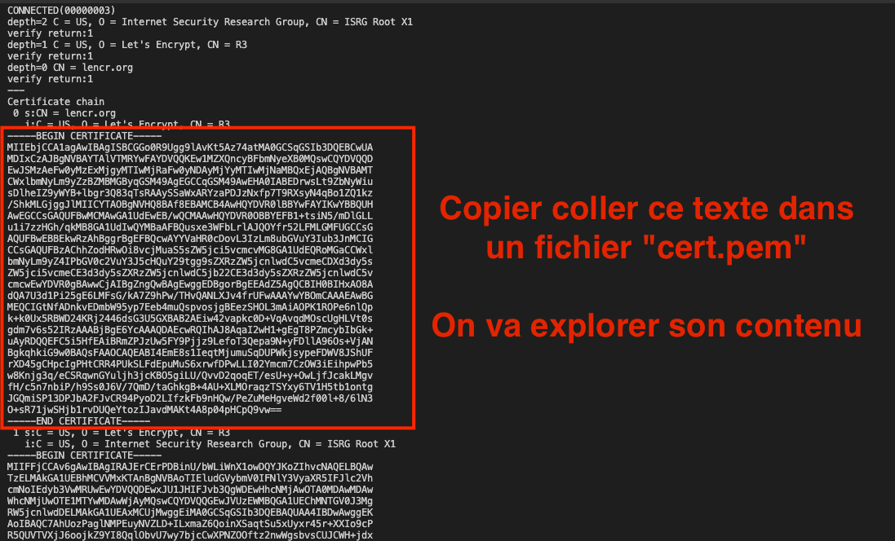
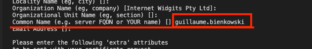

<style scoped>
h1 {
  text-align: center;
}
p {
    position: absolute;
    bottom: 50px;
    right: 30px;
}
img[alt~="center"] {
  display: block;
  margin: 0 auto;
}
</style>

# TP Cryptographie 2ème partie

Guillaume Bienkowski — Braincube

---
<!-- header: "Plan du TP" -->

# TP

1. Fonctions de hachage
1. Signatures digitales
1. Certificats

---
# Récupération du document

Il vous faut ce PDF ouvert pour profiter des liens vers le Web.

Rendez-vous ici: https://masterind4.github.io

Et cliquez sur le lien de téléchargement de ce PDF:


---

# Méthodologie

Le TP se fera sur ordinateur avec un terminal et un navigateur.

Les réponses seront à fournir dans un formulaire situé ici:

https://forms.gle/p4RirfG6Vas9Aaes6

**BIEN REMPLIR VOTRE NOM ET PRENOM**

Il faudra aussi y joindre les fichiers des certificats pour MQTT que vous générerez en fin de session.

---
<!-- header: "Fonctions de hachage" -->

# Fonctions de hachage

## Exercice 1

Rendez-vous sur https://prometheus.io/download/

Téléchargez **la version linux** `amd64` de l'outil `prometheus`

1. Vérifiez à l'aide de l'utilitaire `sha256sum <fichier téléchargé>` que la somme de contrôle est bonne.

2. Extrayez le contenu du fichier (via la commande `tar -xzf <fichier tgz>` ou votre explorateur de fichiers)
3. Placez vous dans le terminal dane le dossier créé (`prometheus-2.xxxx`) et lancez en ligne de commande l'utilitaire `./prometheus --version`


----


# Fonctions de hachage

## Exercice 2

Rendez-vous sur https://masterind4.github.io/antivirus.html

Téléchargez la version 1.0 de `Antivirus.exe`
**UTILISEZ LE MIROIR 1**

1. Vérifiez à l'aide de l'utilitaire `md5sum` que la somme de contrôle est bonne

2. Lancez `Antivirus.exe` (pour le rendre executable, utilisez la commande `chmod +x Antivirus.exe`)

----

# Fonctions de hachage

## On continue l'exercice
Retournez sur https://masterind4.github.io/antivirus.html

3. Téléchargez la version **MIROIR 2** de `Antivirus.exe`
4. Vérifiez à l'aide de l'utilitaire `md5sum` que la somme de contrôle est bonne

Lancez `Antivirus.exe` (pour le rendre executable, utilisez la commande `chmod +x Antivirus.exe`)

1. Que s'est-il passé?

2. Proposez vos idées pour que cela ne puisse plus se reproduire

---

<!-- header: "" -->

# Signatures digitales

## Exercice 1

Rendez-vous sur https://veracrypt.fr/en/Downloads.html

1. Téléchargez la version pour linux debian 12 de veracrypt **ainsi que son fichier de signature PGP**:


2. Téléchargez la clé publique de Veracrypt sur le site idrix (tout en bas de la page de téléchargements)

---
<!-- header: "Signatures digitales" -->

### Vérification

Utilisez `gpg` pour:

1. **importer** (`gpg --import <ficiher de clé>`) la clé publique que vous venez de télécharger (vérifiez le fingerprint)

    Cette étape vous permet d'ajouter la clé **publique** de VeraCrypt dans votre outil GPG de vérification de signatures.

2. **vérifier** (`gpg --verify <fichier de signature.sig>`) la signature du paquet deb que vous venez de télécharger


---

<!-- header: "" -->

# Certificats

### Exercice 1: Utiliser `openssl s_client` pour se connecter de façon sécurisée à un serveur tiers.

1. Utiliser la commande `man s_client` pour vous renseigner sur l'outil `openssl s_client` et comment l'invoquer pour vous connecter à un serveur TLS (pressez `q` pour quitter)

2. Tenter une connection sur `letsencrypt.org` sur le port `443`, utiliser l'option `-showcerts` pour afficher les certificats renvoyés par le serveur et `-text` pour afficher les certificats au format PEM.

Vérifier que la connection retourne bien `Verify return code: 0 (ok)`, qui signifie que la chaîne de certification est bien valide. Tapez `<Entrée>` pour sortir.

---
<!-- header: "Certificats" -->

* Sauvegarder le **premier** certificat affiché par la commande précédente dans un fichier avec l'extension `.pem`

    

---


1. Utiliser la commande `openssl x509 -in <fichier pem> -text` sur le fichier du certificat sauvegardé.


2. Récupérer la liste des DNS autorisés (`Subject Alternative Name`) par le certificat final.

3. Lister les contraintes basiques (`Basic Constraints`) sur le certificat, et expliquer ce que peut signifier cette contrainte.

---

## Exercice 2: Authentification par certificat client

Rendez-vous sur https://test.mosquitto.org/ssl/

1. Suivez les instructions pour créer une CSR d'un certificat à vous, et faites le signer par le rootCA de MQTT via leur interface (chercher "generate your own certificate" sur la page).

    **Mettez bien votre nom quand le CN vous sera demandé** (le reste peut être rempli à votre guise)

    

2. Récupérez le rootCA de mosquitto:

    wget http://test.mosquitto.org/ssl/mosquitto.org.crt

---

Vous allez vous retrouver avec 4 fichiers:

- Une clé **privée** (qui est restée sur votre PC): `client.key`
- Une CSR qui contient votre clé **publique** et que vous envoyez à Mosquitto pour récupérer un certificat signé: `client.csr`
- Un certificat client, signé par Mosquitto, qui va vous permettre de vous identifier chez eux: `client.crt`
- le RootCA de mosquitto, qui permet à votre PC d'authentifier le serveur mosquitto `mosquitto.org.crt`


---


Une fois les étapes précédentes faites, installez mqttx:

```shell
curl -LO https://www.emqx.com/en/downloads/MQTTX/v1.9.8/mqttx-cli-linux-x64
chmod +x mqttx-cli-linux-x64
```

Et lancez le client MQTT pour publier des messages (de manière authentifiée):

Passez vos clés, certificat client, et CA générés et récupérés dans la ligne de commande.

```bash
./mqttx-cli-linux-x64 bench pub -h test.mosquitto.org -p 8884 -l mqtts \
   -v -t master4 -im 5000 -c 1 -m "Coucou c'est $USER" \
   --key client.key --cert client.crt --ca mosquitto.org.crt
```

J'enverrais des messages à intervalles réguliers

---

**Question bonus**: Tentez la connection au serveur mosquitto avec `openssl s_client` en passant les bons arguments pour vous authentifier avec le certificat client et votre clé. N'oubliez pas de passer le certificat root pour dire à Openssl de lui faire confiance.

(Aide: utilisez `openssl s_client --help` et cherchez les arguments à passer)

---

# Aide openssl

Pour se connecter à un serveur:

```bash
openssl s_client -connect HOST:PORT -showcerts
# -showcerts demande à afficher les certificats au format PEM
```

Pour décrire un certificat x509 contenu dans un fichier au formap PEM:

```bash
openssl x509 -text -in CERTFILE
```

---


# Merci à tous!

Rappel: formulaire https://forms.gle/p4RirfG6Vas9Aaes6

