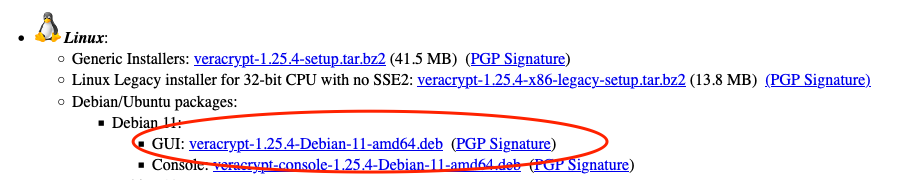

<style scoped>
h1 {
  text-align: center;
}
p {
    position: absolute;
    bottom: 50px;
    right: 30px;
}
img[alt~="center"] {
  display: block;
  margin: 0 auto;
}
</style>

# TP Cryptographie 2ème partie

Guillaume Bienkowski — Braincube

---
<!-- header: "Plan du TP" -->

# TP

1. Fonctions de hachage
1. Signatures digitales
1. Certificats

---
# Récupération des sources

```
git clone https://github.com/masterind4/masterind4.github.io.git
code masterind4.github.io/
```

---
<!-- header: "Fonctions de hachage" -->

# Fonctions de hachage

## Exercice 1

Rendez-vous sur https://prometheus.io/download/

Téléchargez la version linux `amd64` de `pushgateway`

Vérifiez à l'aide de l'utilitaire `shasum` que la somme de contrôle est bonne

Extrayez et lancez en ligne de commande l'utilitaire `pushgateway --help`

----


# Fonctions de hachage

## Exercice 2

Rendez-vous sur https://masterind4.github.io/

Téléchargez la version 1.0 de `Antivirus.exe`
**UTILISEZ LE MIROIR 1**

Vérifiez à l'aide de l'utilitaire `md5sum` que la somme de contrôle est bonne

Lancez `Antivirus.exe`

----

# Fonctions de hachage

## Exercice 2 bis

Rendez-vous sur https://masterind4.github.io/

Téléchargez la version **MIROIR 2** de `Antivirus.exe`

Vérifiez à l'aide de l'utilitaire `md5sum` que la somme de contrôle est bonne

Lancez `Antivirus.exe`

Que s'est-il passé?

Une signature digitale aurait-elle pu aider dans ce cas?

---

<!-- header: "Signatures digitales" -->

# Signatures digitales

Rendez-vous sur https://veracrypt.fr/en/Downloads.html

Téléchargez la version debian 11 de veracrypt ainsi que sa signature PGP:



Profitez-en pour télécharger aussi la clé publique GPG de veracrypt (tout en haut)

---

## Vérification

Utilisez `gpg` pour:
- **importer** (`man gpg`) la clé publique que vous venez de télécharger (vérifiez le fingerprint)
- **vérifier** (`man gpg` verify) la signature du paquet deb que vous venez de télécharger

---

<!-- header: "Certificats" -->


# Certificats

## Exercice 1: Utiliser `openssl s_client` pour se connecter de façon sécurisée à un serveur tiers.

Tenter une connection sur `neolyse.info` sur le port `443`, et utiliser l'option `-showcerts` pour afficher les certificats renvoyés par le serveur.

Vérifier que la connection retourne bien `Verify return code: 0 (ok)`, qui signifie que la chaîne de certification est bien valide.

Aide:
```man s_client```

---

Sauvegarder chaque certificat affichés par la commande précédente dans un fichier avec l'extension `.pem` et faire afficher avec `openssl x509` les détails de chaque certificats (utiliser l'option `-text` pour afficher les détails en format lisible.)

Récupérer la liste des DNS autorisés (`Subject Alternative Name`) par le certificat final.

Constater les contraintes (`Basic Constraints`) sur les certificats intermédiaires, et sur le certificat final (`CA:FALSE`)

---

## Exercice 2: Créer des root CA et des certificats racine

Rendez-vous sur le dossier tp/ du dépôt Git.

L'idée est de créer une petite PKI (Public Key Infrastructure) à partir d'un Root CA généré à la main.
Ensuite nous généreront un certificat fils, signé par le root CA.
Celui ci sera utilisé par un serveur, et nous verrons comment interroger ce serveur de manière sécurisée avec `curl`.


Cet exercice se déroulera en 2 étapes:

- création du root CA
- création du certificat final via une CSR, signée par le root CA

---


### Création du root CA

Les étapes nécessitent de manipuler `openssl` avec les modules `ecparam`, `ec` et `req`.
Référez vous aux pages manuel de ces modules openssl: `man ec`, `man ecparam` et `man req`

- Créez une clé elliptique avec la courbe `prime256v1`. Nommez la `ca.key`
- Récupérez la clé publique associée avec `openssl ec`. Nommez la `ca.pub`
- Créez un certificat root autosigné en utilisant `openssl req`. Il lui faut les caractéristiques suivantes:
  - utilise la clé privé `ca.key`
  - valide 1024 jours
  - signé en sha256
  - nommé `rootCA.pem`
  - Attributs de noms à votre convenance


---

### Création du certificat fils

- Même opération initiale: on crée une paire de clés elliptique de même caractéristiques, nommées `cert.key` et `cert.pub`
- On crée une CSR avec `openssl req`. Pas besoin d'ajouter des extensions, vous pouvez mettre votre username en tant que CN. Nom de la CSR: `cert.csr`.
- On signe un certificat en utilisant ce fichier `csr` et en utilisant le fichier de configuration `ca.conf` inclut dans le dossier `tp/`. Le certificat ainsi signé doit être nommé `cert.pem`. Utiliser `man ca` pour trouver la bonne commande. Le certificat doit avoir une expiration dans 256 jours.


---

### Tests avec `curl`

Une fois le fichier `cert.pem` et `cert.key` créés, on lance le serveur Python en se rendant dans le dossier `tp/` et on utilise:

```bash
python3 serveurSSL.py
```

Dans un autre terminal, lancer une commande `curl` pour joindre votre serveur:

```
curl -v https://127.0.0.1:4443
```

Que se passe-t-il? Trouver un moyen de résoudre le souci.

---

### Dire à curl de valider le certificat

Explorez les options de `curl` (`man curl` ou `curl --help`) pour spécifier un root CA

Relancez la commande avec la bonne option, et joignez le serveur local.

`curl` est-il content cette fois?

Si oui bravo, vous avez créé votre propre PKI.

Dernier test: relancez en changeant l'URL pour `https://localhost:4443`. Que se passe-t-il ?


---

## Exercice 2: Créer un certificat client

Rendez-vous sur https://test.mosquitto.org

Suivez les instructions pour créer une CSR d'un certificat à vous, et faites le signer par le rootCA de MQTT via leur interface.

Pensez bien à récupérer le rootCA de mosquitto.


---

Téléchargez l'appImage ici: https://mqtt-explorer.com/ et lancez-la sur votre ordinateur

Configurez la connexion suivant les instructions de MQTT et en spécifiant votre certificat & clé privée, et le root CA de Mosquitto.
Activez évidemment le TLS.

**Attention:** dans l'interface de MQTT Explorer, supprimez les souscriptions et ajoutez une souscription à `master4` sinon le trafic sera trop gros.
